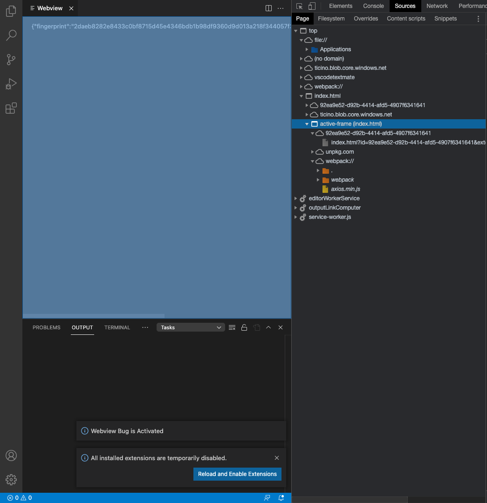

The Webview html is declared in `src/webviews/custom-webview.js`

# Steps

1 - run `yarn install`

2 - run `yarn dev` to build with source maps

3 - go to `Run and Debug` and choose `Extension` to start debugging

4 - open the webview with `TEST: Open Webview` 

5 - verify it shows a fingerprint it got from `http://localhost:5000/vscode/fingerprint`

6 - check that the webview frame is `active` instead of `pending`

My guess about what is causing the issue is that when the webview frame is `pending` it can't issue requests to a `localhost` server. In the image below you can see that the webview frame is `active`. I think that could be the reason because there is no other difference of when I issue requests from a Nuxt app. Also, the Nuxt app runs without any problems on VS Code 1.55.2. 

